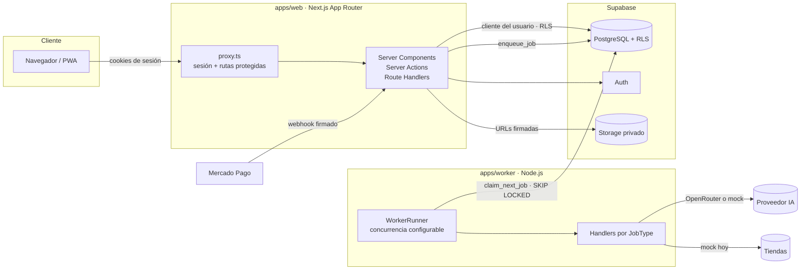

# Arquitectura

## Resumen

Monorepo pnpm + Turborepo con **dos aplicaciones** y paquetes internos. No hay microservicios: la app web (Next.js) atiende a los usuarios y el worker (Node.js) procesa trabajos pesados en segundo plano. Ambos comparten Supabase (PostgreSQL, Auth y Storage).



## Stack

| Capa       | Tecnología                                                     |
| ---------- | -------------------------------------------------------------- |
| Monorepo   | pnpm workspaces (catálogo de versiones) + Turborepo            |
| Web        | Next.js 16 (App Router, `proxy.ts`), React 19, Tailwind CSS v4 |
| Worker     | Node.js 24 + TypeScript, bundle con tsup                       |
| Datos      | Supabase: PostgreSQL 17, Auth, Storage                         |
| Validación | Zod 4 en todos los límites externos                            |
| Calidad    | TypeScript `strict`, ESLint 9 (flat config), Prettier          |
| Tests      | Vitest (unit + integración), Playwright (E2E)                  |
| CI         | GitHub Actions                                                 |

## Estructura

```
apps/
  web/        Next.js: UI, Server Actions, Route Handlers, proxy de sesión, admin
  worker/     Loop de jobs: toma trabajos de Postgres y ejecuta handlers
packages/
  config/     ESLint, tsconfig y variables de entorno (Zod): public / server / worker
  shared/     Dominio puro: schemas Zod, tipos, constantes, logger, rate limit, fixtures
  db/         Tipos generados, clientes Supabase, auth helpers, cola de jobs, Storage, seed
  ai/         Abstracción de IA: operaciones tipadas, OpenRouterProvider, MockAIProvider, prompts
  shopping/   Pipeline de productos: search → fetch → extract → normalize → rank → cache
  payments/   PaymentProvider, MockPaymentProvider, esqueleto Mercado Pago, estados
  analytics/  AnalyticsService + DatabaseAnalyticsProvider, registro de uso de IA
supabase/     config.toml, migraciones y seed.sql mínimo
docs/         Esta documentación
```

### Dependencias entre paquetes

```
shared ← config (solo env)
shared ← db ← analytics
shared ← ai
shared ← shopping
shared ← payments
web    → todos
worker → ai, analytics, config, db, shared, shopping
```

Sin ciclos. `shared` no depende de nadie interno ni hace I/O de red.

## Separación de capas

- **UI** (`apps/web/src/app`, `apps/web/src/components`): renderiza y llama a Server Actions / Route Handlers. No contiene reglas de negocio ni prompts.
- **Dominio** (`packages/shared`): schemas, tipos y reglas puras (p. ej. `isPremiumSubscription`, `checkPhotoFile`, `computeRetryDelaySeconds`).
- **Integraciones** (`packages/db`, `ai`, `shopping`, `payments`, `analytics`): adaptadores a proveedores externos detrás de interfaces (`AIProvider`, `SearchProvider`, `ProductFetcher`, `PaymentProvider`, `AnalyticsProvider`).

## Paquetes internos sin build

Los paquetes exportan TypeScript directamente (`exports` → `./src/*.ts`).

- En la web, Next.js los transpila (`transpilePackages`).
- En el worker, tsup genera un bundle autocontenido (`noExternal: [/.*/]`), así la imagen Docker no necesita `node_modules`.
- Vitest y tsx los ejecutan directamente.

## Clientes de Supabase

Cada uno en un subpath de `@asesor/db` para que el código de servidor nunca llegue al bundle del navegador:

| Subpath              | Uso                                 | Credencial    | RLS         |
| -------------------- | ----------------------------------- | ------------- | ----------- |
| `@asesor/db/browser` | Componentes de cliente              | anon          | Sí          |
| `@asesor/db/server`  | RSC, Server Actions, Route Handlers | anon + sesión | Sí          |
| `@asesor/db/proxy`   | `proxy.ts` (refresco de sesión)     | anon + sesión | Sí          |
| `@asesor/db/service` | Servidor web (admin, webhooks)      | service role  | No (bypass) |
| `@asesor/db/worker`  | Worker                              | service role  | No (bypass) |
| `@asesor/db/admin`   | Base de los anteriores, seed, tests | service role  | No (bypass) |

`server` y `service` importan `server-only`. La regla por defecto es usar el cliente del usuario; service role solo cuando RLS no permite la operación (y siempre después de autorizar en el servidor).

## Variables de entorno

Centralizadas en `packages/config/src/env` y validadas con Zod. Nadie lee `process.env` directamente (regla ESLint `no-restricted-properties`, salvo configs, scripts y tests).

- `getPublicEnv()` — solo `NEXT_PUBLIC_*`, referenciadas de forma literal para que Next las incruste.
- `getServerEnv()` — públicas + secretos del servidor. Lanza si se ejecuta en el navegador.
- `getWorkerEnv()` — lo que necesita el worker (URL, service role, concurrencia).

El `.env` vive en la raíz y lo comparten web (`loadEnvConfig` en `next.config.ts`) y worker (`--env-file-if-exists`).

## Autenticación y autorización

- Supabase Auth con email/contraseña. Sesión en cookies (`@supabase/ssr`), refrescada en `proxy.ts` con `getUser()` (misma validación que las páginas; si Auth rechaza la sesión, se borran las cookies para no generar loops de redirección).
- Al registrarse, el trigger `handle_new_user` crea `profiles` (con `age_confirmed_at`).
- Barreras en capas: `proxy.ts` (redirección) → `requireUser()` en cada página → helpers de `@asesor/db` (`requireAuth`, `requirePremium`, `requireAdmin`, `requireResourceOwner`) → **RLS** en Postgres.
- `/admin` exige `profiles.role = 'admin'` en el servidor; si no, responde 404.

## Jobs

Cola en PostgreSQL (sin Redis ni servicios externos). Ver `DATA_MODEL.md` y `AI_PIPELINE.md`.

- `enqueue_job` (con clave de idempotencia opcional), `claim_next_job` (`FOR UPDATE SKIP LOCKED`, recupera locks vencidos), `complete_job`, `fail_job` (backoff exponencial, errores no reintentables), `retry_job` (manual).
- Solo `service_role` puede ejecutarlas.
- `WorkerRunner`: N carriles (`WORKER_CONCURRENCY`), polling con espera, apagado limpio con SIGTERM/SIGINT (deja de tomar jobs, espera los activos, aborta los que exceden el timeout y quedan reintentables).

## PWA

- `app/manifest.ts`, íconos placeholder (`scripts/generate-icons.mjs`), `viewport`/`themeColor` en el layout.
- `public/sw.js`: solo cachea `/_next/static`, íconos y `/offline`. Nunca cachea páginas autenticadas, `/api`, fotos, URLs firmadas ni requests a otros orígenes. Se registra solo en producción.

## Observabilidad

- Logger JSON estructurado (`createLogger` en `@asesor/shared`) en web y worker. Redacta claves sensibles (tokens, cookies, contraseñas, firmas, URLs firmadas, payloads, emails, imágenes) y trunca strings largos.
- `ai_usage` registra cada operación de IA (tokens, imágenes, costo estimado, duración, éxito).
- `analytics_events` guarda eventos de producto; el navegador solo puede emitir una lista blanca vía `/api/analytics`.

## Decisiones

- **Sin ORM.** Tipos generados por Supabase (`pnpm db:types`) + supabase-js. Menos capas, RLS nativo.
- **Seed en TypeScript** (`packages/db/scripts/seed.ts`) en lugar de SQL: usa la API de Auth, valida con los mismos schemas Zod y reutiliza los fixtures.
- **Rate limiting en memoria** detrás de una interfaz (`RateLimiter`). Alcanza para una instancia; con varias, reemplazar por una implementación en Postgres.
- **CSP sin nonces** (Next necesita `'unsafe-inline'` para hidratar). Se restringen orígenes, frames, formularios y objetos.
- **Imágenes privadas con ``**, no `next/image`, para que no pasen por el cache del optimizador.
