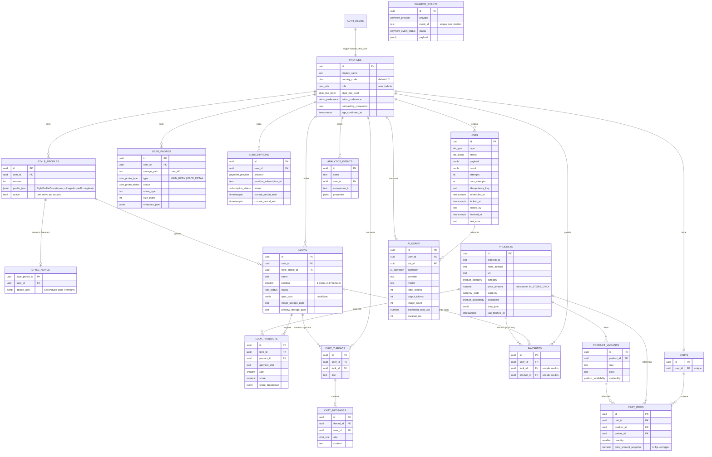

# Modelo de datos

Fuente de verdad: `supabase/migrations/*.sql` (se aplican desde cero con `pnpm db:reset`). Los tipos TypeScript se generan con `pnpm db:types` → `packages/db/src/database.types.ts` (CI verifica que estén al día).

Convenciones:

- PK `uuid` (`gen_random_uuid()`), salvo `profiles.id` = `auth.users.id`.
- `created_at` en todas las tablas; `updated_at` (trigger `set_updated_at`) en las que se modifican.
- Enums de Postgres para estados estables; `jsonb` para estructuras de IA que todavía evolucionan (`profile_json`, `spec_json`, `metadata`), siempre validadas con Zod al leer/escribir.
- Borrar un usuario borra en cascada todos sus datos.

## Diagrama

## Tablas

| Tabla                   | Propósito                                                                      | Escribe                                |
| ----------------------- | ------------------------------------------------------------------------------ | -------------------------------------- |
| `profiles`              | Perfil de la app, 1:1 con `auth.users`                                         | Trigger + usuario (columnas limitadas) |
| `style_profiles`        | Versiones del StyleProfile (jsonb); una activa por usuario                     | Worker                                 |
| `style_advice`          | Asesoría detallada (Premium) de cada StyleProfile, 1:1                         | Worker                                 |
| `user_photos`           | Metadata de fotos; el archivo está en Storage. Una por tipo                    | Usuario (insert/delete)                |
| `looks`                 | 3 looks por StyleProfile (`position` 1..3) con `spec_json`                     | Worker                                 |
| `products`              | Catálogo global normalizado de tiendas externas                                | Worker / servidor                      |
| `product_variants`      | Talles/colores con stock propio                                                | Worker / servidor                      |
| `look_products`         | Ranking de productos por prenda (`garment_slot`) de un look, con `size_status` | Worker (`replace_look_products`)       |
| `shopping_search_cache` | Pools de búsqueda (24 h): uuids de productos validados de una prenda           | Solo service role                      |
| `favorites`             | Looks o productos guardados (exactamente uno)                                  | Usuario                                |
| `carts`                 | Un carrito externo por usuario                                                 | Usuario (Premium)                      |
| `cart_items`            | Productos del carrito; el precio lo fija un trigger desde `products`           | Usuario (Premium)                      |
| `subscriptions`         | Estado del plan Premium por proveedor                                          | Servidor (tras validar el pago)        |
| `payment_events`        | Webhooks recibidos; `unique(provider, event_id)` = idempotencia                | Servidor                               |
| `chat_threads`          | Conversaciones con el asesor                                                   | Usuario (Premium)                      |
| `chat_messages`         | Mensajes; el usuario solo puede escribir `role = 'user'`                       | Usuario / servidor                     |
| `jobs`                  | Cola de trabajos                                                               | Solo service role                      |
| `ai_usage`              | Costo y uso de cada operación de IA                                            | Solo service role                      |
| `analytics_events`      | Eventos de producto                                                            | Solo service role                      |

## StyleProfile guardado

El análisis (`StyleProfile` v3, ver `AI_PIPELINE.md`) se guarda partido para que la parte Premium quede protegida por RLS (D4):

- `style_profiles.profile_json`: núcleo teaser (`StyleProfileCoreSchema`: `schema_version: 3`, `appearance`, `colors`, `strengths`, `avoid`, `style_direction`). Lo lee cualquier plan. Desde v3, `appearance` incluye la silueta (`body_shape`), las proporciones (`torso_legs`) y los rasgos del rostro (`face_features`): las etiquetas son visibles para free y las notas para equilibrar la silueta (`body_proportions.balance_notes`) siguen en la asesoría Premium (D26). No hizo falta migración: el reparto es por claves de primer nivel.
- `style_advice.advice_json`: asesoría detallada (`StyleAdviceSchema`: pelo, grooming, proporciones, ropa y fit, materiales, calzado, accesorios, tatuajes, `general_advice`). PK = `style_profile_id`; FK compuesta `(style_profile_id, user_id)` → `style_profiles (id, user_id)`, así nunca apunta al perfil de otro usuario. RLS: `select` solo propio y con `current_user_is_premium()`; nadie escribe desde el cliente.
- Perfiles v2 (2026-09-30 a 2026-10-01): mismo reparto, sin perfil visual. `parseStoredStyleProfile` los sube a v3 con `face_features: []` y silueta y proporciones `UNKNOWN`.
- Perfiles v1 (anteriores al 2026-09-30): el perfil completo quedó en `profile_json` y no tienen fila en `style_advice`. `parseStoredStyleProfile` los sube a v3 con la asesoría nueva vacía. Solo existen en bases locales (no hay producción).
- `looks.spec_json` anteriores al 2026-10-01 tienen `reasoning` como lista de strings; `StoredLookSpecSchema` los lee como razones de aspecto `STYLE` (ver `AI_PIPELINE.md`).

## Productos de tiendas

`products` guarda el `Product` normalizado (`packages/shared`); `data_json` tiene el objeto completo, con las variantes y `in_store`.

- **Precio** (migración `20261001000100_in_store_price.sql`, D10): `price_amount` y `currency` pueden ser `null` solo en un local físico que no publica el precio. El check `products_price_known` exige que vayan juntos y que, si faltan, `availability = 'IN_STORE_ONLY'`.
- **Local físico**: ubicación y contacto (`in_store`: dirección, localidad, teléfono, link) van en `data_json`, sin columnas nuevas.
- **Variantes** (`product_variants`): `size` es el talle normalizado (`M`, `42`, `US 9`, `ÚNICO`). La etiqueta de la tienda (`size_label`) queda en `data_json`.
- **Carrito**: `set_cart_item_price_snapshot()` rechaza un producto sin precio con un error explícito (`22023`): un local físico no se compra online.
- **Identidad y cache** (migración `20261001000200_shopping_cache.sql`, paso 05): el upsert es por `url` (canónica). El único `(store_domain, external_id)` pasó a ser un índice común, porque un handle renombrado o un id externo que cambia entre corridas chocaba con el único de `url`. `products` y `product_variants` son la cache persistente de productos (frescura de 8 h con `last_fetched_at`, que solo avanza con una verificación exitosa).
- **Pools de búsqueda** (`shopping_search_cache`): `key` (sha256 de la prenda, sin talle, precio máximo, límite ni datos del usuario), `query_json`, `product_ids uuid[]`, `stats`, `expires_at` (24 h, con índice para purgar). RLS habilitada y sin grants para `anon` ni `authenticated`: solo el worker.
- **Resultados por look** (`look_products`): `size_status` (`AVAILABLE`, `OUT_OF_STOCK`, `NOT_OFFERED`, `UNVERIFIED`, `NOT_REQUESTED`, `NOT_APPLICABLE`; null en filas anteriores) para mostrar "talle sin verificar" con honestidad. El ranking de una prenda se reemplaza entero y de forma atómica con `replace_look_products`. Lo lee solo el dueño Premium.

## Índices principales

- `jobs_queue_idx (priority desc, scheduled_at) where status = 'QUEUED'` — índice parcial para `claim_next_job`.
- `jobs_running_idx (locked_at) where status = 'RUNNING'` — recuperación de locks vencidos.
- `style_profiles_one_active_per_user` — índice único parcial.
- Índices en todas las FKs usadas en filtros o joins (`looks.user_id`, `favorites.*`, `cart_items.*`, `chat_*`, `ai_usage.*`...).
- `analytics_events (name, created_at desc)`, `ai_usage (created_at desc)` para el admin.

## Row Level Security

RLS habilitado en **todas** las tablas. Resumen (ver `20260929000300_rls_policies.sql`):

- `anon`: sin acceso a ninguna tabla.
- `authenticated`: solo sus filas (`user_id = auth.uid()`), y solo las columnas con `GRANT` explícito. Por ejemplo, en `profiles` puede cambiar `display_name`, `style_risk_level`, `tattoo_preference` y `onboarding_completed`, pero **no** `role` ni `country_code`.
- Premium reforzado en datos: `looks` con `position > 1`, `style_advice`, `look_products`, `carts`, `cart_items`, `chat_*` y favoritos de productos requieren `current_user_is_premium()`.
- IDOR: los inserts que referencian otros recursos (favoritos, hilos de chat, ítems del carrito) verifican que el recurso sea del usuario.
- `jobs`: el usuario puede **leer** el estado de sus jobs (columnas no sensibles); nunca crear ni modificar.
- `ai_usage`, `analytics_events`, `payment_events`: sin acceso desde el cliente.
- `service_role` tiene acceso completo (lo usan servidor y worker).

`current_user_is_premium()` replica `isPremiumSubscription()` de `@asesor/shared`: `ACTIVE` o `CANCELLED` con `current_period_end > now()`. Si cambia una, hay que cambiar la otra.

## Storage

| Bucket            | Público | Límite | MIME            | Escribe          | Lee                                                      |
| ----------------- | ------- | ------ | --------------- | ---------------- | -------------------------------------------------------- |
| `user-photos`     | No      | 10 MB  | jpeg, png, webp | Dueño            | Dueño                                                    |
| `generated-looks` | No      | 15 MB  | jpeg, png, webp | Worker (service) | Dueño; imagen completa solo si el look está desbloqueado |

Rutas: `<user_id>/<...>`. Las políticas comparan la primera carpeta con `auth.uid()`. El acceso es siempre con URLs firmadas de 5 minutos.

## Funciones SQL

| Función                                    | Quién la ejecuta | Qué hace                                                                      |
| ------------------------------------------ | ---------------- | ----------------------------------------------------------------------------- |
| `handle_new_user()`                        | Trigger          | Crea `profiles` al registrarse                                                |
| `set_cart_item_price_snapshot()`           | Trigger          | Fija precio y moneda del ítem desde el catálogo; rechaza productos sin precio |
| `replace_look_products(look, slot, items)` | service_role     | Reemplaza el ranking de una prenda de un look en una transacción              |
| `current_user_is_premium()`                | RLS              | Regla Premium                                                                 |
| `current_user_is_admin()`                  | RLS / servidor   | Rol admin                                                                     |
| `can_read_generated_look(name)`            | Política Storage | Imagen generada visible según look y plan                                     |
| `enqueue_job(...)`                         | service_role     | Encola (idempotente con `idempotency_key`)                                    |
| `claim_next_job(...)`                      | service_role     | Toma el próximo job con `FOR UPDATE SKIP LOCKED`                              |
| `complete_job(...)`                        | service_role     | Marca COMPLETED (solo el worker que lo tomó)                                  |
| `fail_job(...)`                            | service_role     | Reintenta con delay o marca FAILED                                            |
| `retry_job(id)`                            | service_role     | Reintento manual de un FAILED                                                 |
| `admin_overview_metrics()`                 | service_role     | Métricas del overview de `/admin`                                             |
| `admin_event_counts(days)`                 | service_role     | Conteo de eventos para `/admin/analytics`                                     |
